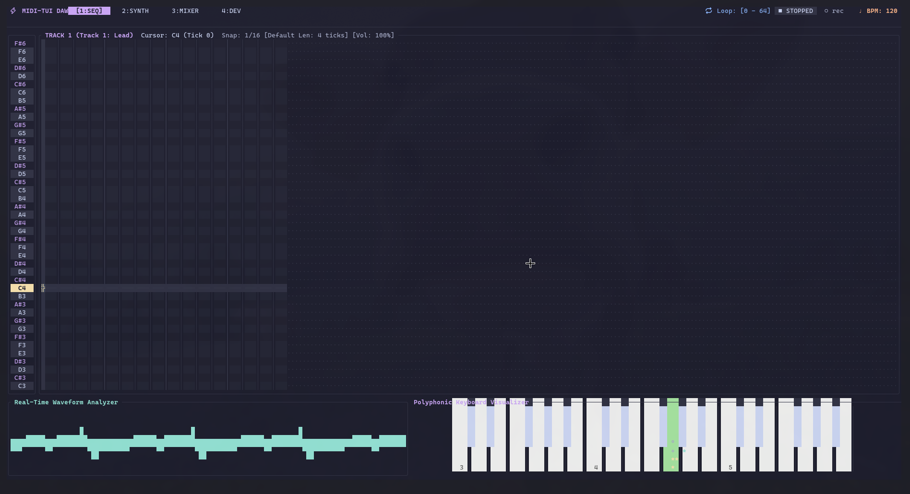
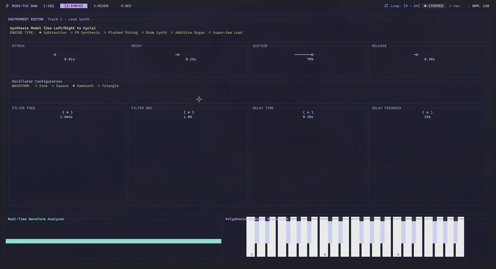
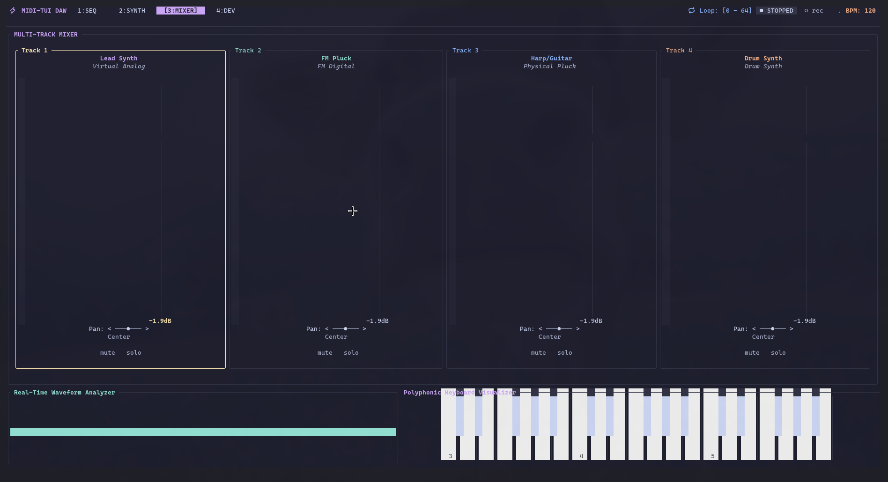
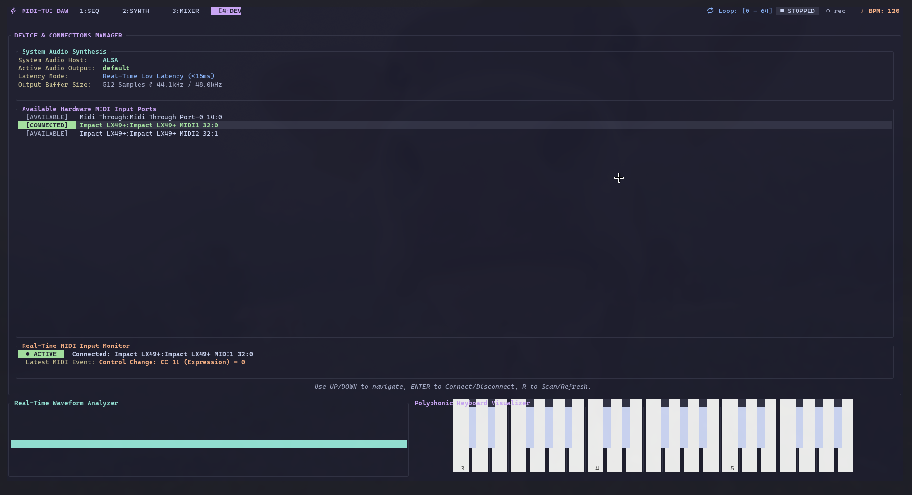

# midi-tui

> **A Real-Time, Low-Latency Terminal Digital Audio Workstation (TUI DAW), Synthesizer & Step Sequencer built in Rust.**

`midi-tui` brings high-performance electronic music production directly to the command line. Featuring multiple polyphonic synthesis engines, a visual step sequencer, an audio mixer board, real-time waveform analyzers, and plug-and-play external hardware MIDI controller scanning and monitoring, it combines terminal efficiency with premium audio engineering.

Designed with a sleek **Catppuccin Mocha** dark mode palette and animated elements, `midi-tui` is highly responsive, lightweight, and low-latency (<15ms stream feedback).

---

## Features & Architecture

### Screenshots

<!-- You can replace these placeholders with actual image links once you have taken screenshots.
     E.g.,  -->


| Sequencer & Piano Roll | Synthesizer Editor |
| --- | --- |
| | _ |

| Audio Mixer Board | MIDI Connections Manager |
| --- | --- |
|  | _ |

### 1. Extensible Polyphonic Synthesis Engines
Each of the 4 mixer tracks can be loaded with any of our 6 standard and physical-modeled synthesizers:
* **Subtractive Poly-Synth**: Classic virtual-analog modeling featuring multi-waveform oscillators (Sine, Square, Saw, Triangle), dedicated Attack-Decay-Sustain-Release (ADSR) envelopes, and a resonant low-pass filter.
* **Frequency Modulation (FM) Synth**: Rich digital operator setup (Carrier + Modulator) capable of producing metallic tines, bell chimes, and deep digital bass sounds.
* **Karplus-Strong Plucked String**: Physical modeling synthesis exciting a feedback delay line with high-pass filtered noise bursts, producing realistic acoustic guitar and harp textures.
* **Percussive Drum Synth**: Optimized synthesis modules for Kick (pitch-swept oscillator), Snare (white noise bandpass filter), and Hi-Hat (high-pass filtered noise bursts).
* **Additive Organ/Bell Synth**: Multi-harmonic bell generator stacking up to 6 custom harmonics. Modulates harmonic roll-off decay slope and spacing dynamically.
* **Super-Saw Lead Synth**: Legendary Roland JP-8000 style vintage emulation, dynamically stacking up to 7 detuned sawtooth oscillators in real-time with adjustable detune spread and voice counts.

### 2. Live MIDI Port Manager & Input Monitor
* **Dynamic Hardware Scanning**: Connect a new USB MIDI keyboard or pad controller, hit `R` to scan, and connect instantly without restarting the application.
* **Real-Time Activity Monitor**: Displays active physical MIDI messages parsed into human-readable logs—translating MIDI pitches into musical note names (e.g. `Note ON: C4 (Velocity 104)`) and control change codes into active parameters (e.g. `Control Change: CC 74 (Filter Cutoff) = 112`).
* **Expressive Capture**: Captures physical strike velocities and embeds them directly into sequencer recordings.

### 3. Step Sequencer & Piano Roll
* **Responsive Visual Grid**: Standard scrollable piano roll supporting both keyboard cursor plotting and mouse clicking (left click to place, right click to delete).
* **Flexible Quantization Grid**: Instantly scale grid snapping resolution (`1/16`, `1/8`, `1/4`, `1/2`, `1 Bar`) and default note duration on the fly to write micro-timings or sustained chords.
* **QWERTY Key Debouncer**: Dynamic keyboard heartbeat tracker that filters terminal key-repeat events to enable true natural key sustain on your computer keyboard without premature cutoffs.

### 4. Interactive Mixer & DSP Rack
* Multi-channel mixer board featuring volume sliders, panning dials, track mute, and solo controls.
* Master stereo delay unit (Feedback & Delay Time controls) and global resonant filter rack.
* Floating real-time soundwave visualizer rendering master output waveforms using custom Braille canvas cells.

---

## System Requirements & Setup

### OS Dependencies
`midi-tui` relies on low-level system audio packages (`CPAL` and `Midir`) for high-fidelity audio stream rendering.

#### Linux (Debian/Ubuntu)
Install the ALSA and compilation development headers:
```bash
sudo apt update
sudo apt install libasound2-dev pkg-config
```

#### macOS / Windows
No extra drivers or headers required! Standard frameworks (CoreAudio on macOS, WASAPI on Windows) are supported out-of-the-box.

---

## Installation & Running

Choose one of the following methods to install or run `midi-tui`.

### Prerequisites
Make sure you have installed the required [OS Dependencies](#os-dependencies) (e.g., `libasound2-dev` and `pkg-config` on Linux) before proceeding.

### Method 1: Install System-wide via Cargo (Recommended)
If you have Rust installed, you can compile and install the TUI globally from GitHub in a single command:
```bash
cargo install --git https://github.com/Abhijit-Kadalli/midi-tui.git
```
This automatically downloads, compiles, and copies the `midi-tui` executable to your Cargo binary directory (usually `~/.cargo/bin/`, which should be in your system `PATH`). You can then launch the DAW from anywhere by simply typing:
```bash
midi-tui
```

### Method 2: Build & Install from Source
To clone and compile the source code manually:
```bash
# Clone the repository
git clone https://github.com/Abhijit-Kadalli/midi-tui.git
cd midi-tui

# Build in optimized release mode
cargo build --release

# (Optional) Install the compiled binary into your local path
cp target/release/midi-tui /usr/local/bin/  # or ~/.cargo/bin/
```
Once built, you can run the binary directly:
```bash
./target/release/midi-tui
```

### Method 3: Run Directly with Cargo
To test or run the application quickly without installing:
```bash
git clone https://github.com/Abhijit-Kadalli/midi-tui.git
cd midi-tui
cargo run --release
```

---

## Keyboard Shortcuts Reference

Navigate screens and trigger sound controls with responsive hotkeys:

### Global Controls
| Key | Action |
| :--- | :--- |
| `1` | Switch to **Sequencer / Piano Roll** |
| `2` | Switch to **Synthesizer Parameter Editor** |
| `3` | Switch to **Mixer Board** |
| `4` | Switch to **MIDI Devices Connection Manager** |
| `5` | Switch to **Help Screen & Manual** |
| `Space` | Toggle Playback Transport (outside Piano Roll grid) |
| `P` / `p` | Toggle Playback Transport |
| `R` / `r` | Toggle Recording Armed/Muted (outside Devices tab) |
| `Ctrl+S` / `Ctrl+s` | Save Project Session (`.json`) |
| `Ctrl+O` / `Ctrl+o` | Load Project Session (`.json`) |
| `Ctrl+E` / `Ctrl+e` | Export Song to Standard MIDI File (`.mid`) |
| `Esc` / `Q` / `q` | Exit Application / Close Dialog Modals |

### 1. Sequencer View (Piano Roll)
| Key | Action |
| :--- | :--- |
| `Arrow Keys` | Move Grid Cursor |
| `Space` | Add note at cursor / Remove note at cursor if occupied |
| `[` | Decrease Grid Snap quantization (`1/16` ➔ `1/8` ➔ `1/4` ➔ `1/2` ➔ `1 Bar`) |
| `]` | Increase Grid Snap quantization (`1 Bar` ➔ `1/2` ➔ `1/4` ➔ `1/8` ➔ `1/16`) |
| `-` | Shrink new note duration (Subtracts `1` tick) |
| `+` / `=` | Grow new note duration (Adds `1` tick) |
| `A` through `;` | Play computer virtual keyboard (QWERTY White Keys) |
| `W` through `P` | Play computer virtual keyboard (QWERTY Black Keys) |

### 2. Synth Editor Tab
| Key | Action |
| :--- | :--- |
| `Tab` / `Shift+Tab` | Cycle focus between Envelope, Filter, and Engine parameters |
| `Left` / `Right Arrow` | Decrement / Increment focused parameter value |
| `Down` / `Up Arrow` | Jump to previous / next parameter rows |

### 3. Mixer Board Tab
| Key | Action |
| :--- | :--- |
| `Tab` / `Shift+Tab` | Cycle focus between Volume, Pan, Mute, and Solo strips |
| `Left` / `Right Arrow` | Shift focus to another instrument track (Track 1 - 4) |
| `Up` / `Down Arrow` | Adjust volume level or panning direction |
| `Enter` | Toggle active Mute / Solo states |

### 4. MIDI Devices Manager Tab
| Key | Action |
| :--- | :--- |
| `Up` / `Down Arrow` | Scroll through available hardware MIDI ports list |
| `Enter` | Connect / Disconnect selected MIDI controller |
| `R` / `r` | Scan/Refresh for newly plugged-in USB MIDI controllers |

---

## License
This project is open-source and available under the [MIT License](LICENSE).
